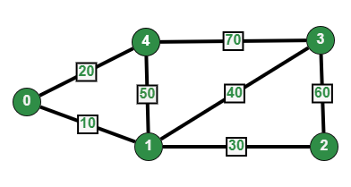

# Graph Implementation STL

## Unweighted Graph


#### Code
```c++
#include<iostream>
#include<vector>
using namespace std;

void addEdge(vector<int> adj[],int u,int v)
{
    adj[u].push_back(v);
    adj[v].push_back(u);
}

void printGraph(vector<int> adj[],int V)
{
    for(int i=0;i<V;i++)
    {
        cout<<i<<"  ";
        for(int ele:adj[i])
        {
            cout<<ele<<" -> ";
        }
        cout<<" .\n";
    }
}

int main()
{
    // No Of Vertices
    int V = 5;
    vector<int> adj[V];
    addEdge(adj,0,1);
    addEdge(adj,0,4);
    addEdge(adj,1,2);
    addEdge(adj,1,3);
    addEdge(adj,1,4);
    addEdge(adj,2,3);
    addEdge(adj,3,4);

    printGraph(adj,V);
    return 0;
}
```

## Weighted Graph



#### Code
```c++
#include<utility>
#include<iostream>
#include<vector>
using namespace std;

void addEdge(vector<pair<int,int>> grph[],int u,int v,int wt)
{
    grph[u].push_back(make_pair(v,wt));
    grph[v].push_back(make_pair(u,wt));
}

void printGraph(vector<pair<int,int>> grph[],int V)
{
    for(int i=0;i<V;i++)
    {
        cout<<"Node "<<i<<" :\n";
        for(pair<int,int> ele:grph[i])
        {
            cout<<"-> Node "<<ele.first<< "  =  "<<ele.second<<"\n";
        }
    }
}

int main()
{
    int V = 5;
    vector<pair<int,int>> grph[V];
    addEdge(grph, 0, 1, 10);
    addEdge(grph, 0, 4, 20);
    addEdge(grph, 1, 2, 30);
    addEdge(grph, 1, 3, 40);
    addEdge(grph, 1, 4, 50);
    addEdge(grph, 2, 3, 60);
    addEdge(grph, 3, 4, 70);

    printGraph(grph,V);
    return 0;
}
```