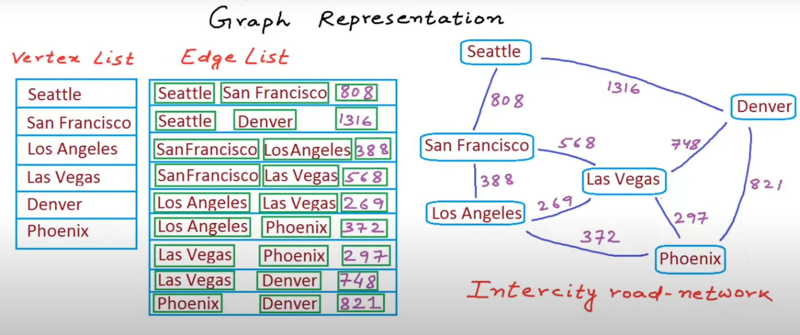

# Road Network using Edge List



```c++
#include<bits/stdc++.h>
#define MOD 1000000007
typedef long long LL;
using namespace std;

// Road Network Graph to Store Distance between cities

class Edge
{
    public:
    int index_city1;
    int index_city2;
    int distance;

    Edge(int index1,int index2, int dis)
    {
        index_city1 = index1;
        index_city2 = index2;
        distance = dis;
    }
};


class Graph
{
    // To Store Vectex Index
    vector<string> cities;
    // Hash DS to get City Index from Name in O(1)
    unordered_map<string,int> citiesHash;


    // To Store Edge
    vector<Edge> connections;


    public:
    void addVertex(string city)
    {
        cities.push_back(city);
        citiesHash[city] = cities.size()-1;
    }

    int getCityIndex(string city)
    {
        return citiesHash[city];
    }

    void addEdge(string city1,string city2,int distance)
    {
        connections.push_back(Edge(getCityIndex(city1),getCityIndex(city2),distance));
    }


    string getNearestCity(string city)
    {
        int given_indx = citiesHash[city];
        int index;
        int minDist = INT_MAX;
        for(Edge eg: connections)
        {
            if(eg.index_city1 == given_indx || eg.index_city2 == given_indx)
            {
                if(eg.distance < minDist)
                {
                    minDist = eg.distance;

                    if(eg.index_city1==given_indx)
                    {
                        index = eg.index_city2;
                    }
                    else
                    {
                        index = eg.index_city1;
                    }
                }
            }
        }
        return cities[index];
    }
};

int main()
{
    ios::sync_with_stdio(false);
    cin.tie(0); cout.tie(0);

    Graph myg;
    myg.addVertex("Seattle");
    myg.addVertex("San Francisco");
    myg.addVertex("Los Angeles");
    myg.addVertex("Las Vegas");
    myg.addVertex("Denver");
    myg.addVertex("Phoenix");

    myg.addEdge("Seattle","San Francisco",808);
    myg.addEdge("Seattle","Denver",1316);
    myg.addEdge("San Francisco","Los Angeles",388);
    myg.addEdge("San Francisco","Las Vegas",568);
    myg.addEdge("Los Angeles","Las Vegas",269);
    myg.addEdge("Los Angeles","Phoenix",372);
    myg.addEdge("Las Vegas","Phoenix",297);
    myg.addEdge("Las Vegas","Denver",748);
    myg.addEdge("Phoenix","Denver",821);

    cout<<myg.getNearestCity("San Francisco");
    return 0;
}
```
